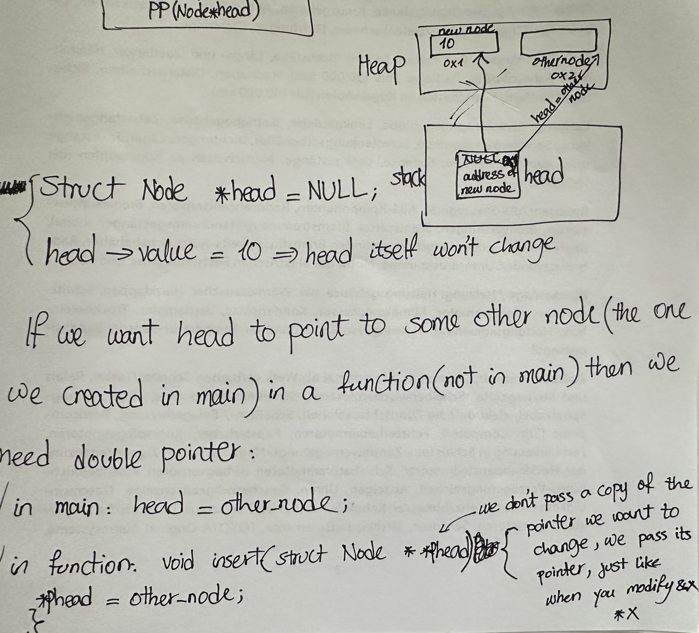

# Linked List

## Introduction

When the size of a data structure needs to be decided at runtime, arrays can be limiting because their size must be defined at compile time. This is a problem when we need flexibility.

Arrays have the benefit that their elements are stored contiguously in memory, similar to people sitting on a bench.

## Linked List Concept

In a linked list, each element (called a node) is allocated separately in the heap. Each node contains data and a pointer to the next node, similar to each person having a chair and pointing to the next person.

A linked list is a collection of nodes where each node contains:
- Data (can be of any type)
- A pointer to the next node

The **head** is a pointer that points to the first node in the list (i.e., it stores the address of the first node).

## Node Structure

The pointer in each node points to another node and has the type `struct Node *`. This is called a self-referential structure.

```c
struct Node {
    int data;
    struct Node *pointer; // This is called a self-referential structure
};
```

- In a structure, members are public by default.
- In a class (in C++), members are private by default.

## Memory Usage

- The size of a pointer depends on the system architecture. On a 64-bit system, a pointer typically takes 8 bytes.
- The total size of each node is the sum of the size of its data and the size of the pointer.
- Nodes in a linked list are not necessarily stored contiguously in memory. Each node can be located anywhere in the heap, and the pointer simply stores the address of the next node.

This means the next node can be anywhere in memory, not necessarily right after the previous node.

--- 
## Display Linked List

Once we have created a linked list, we often want to **display** its contents. To do this, we need to **traverse** the linked list, which means visiting each node exactly once.

To traverse a linked list:
1. Create a temporary pointer and initialize it to point to the head (the first node).
2. While the temporary pointer is not `NULL`:
    - Access and process (e.g., print) the data in the current node.
    - Move the temporary pointer to the next node by following the pointer in the current node.

This process continues until the temporary pointer becomes `NULL`, indicating the end of the list.

Example code to display a linked list in C:

```c
void display(struct Node *head) {
    struct Node *p = head;
    while (p != NULL) {
        printf("%d ", p->data);
        p = p->pointer;
    }
    printf("\n");
}
```
- Here, `head` is a pointer to the first node.
- The loop visits each node and prints its data.
- The traversal stops when the pointer reaches `NULL`, which marks the end of the list.

## Hey previous node, in your next field, store the location of this brand new guy I just made.

---
### Pointer to a pointer



- A single pointer gives you access to the thing it points to.
- A double pointer gives you access to the pointer itself — so you can reassign it.


